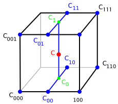
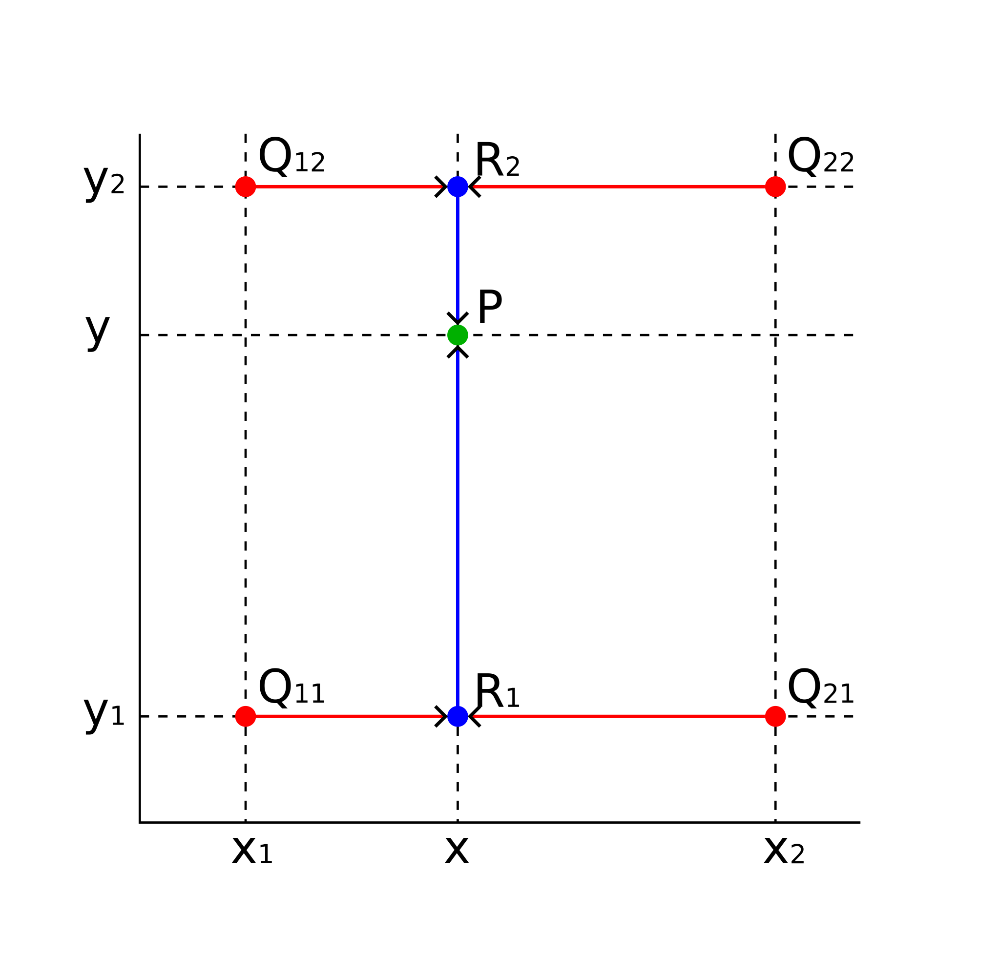

# EFM

- [EFM](#efm)
  - [Introduction](#introduction)
  - [Quick start](#quick-start)
  - [Basic API](#basic-api)
    - [Real field](#real-field)
    - [Complex field](#complex-field)
    - [Other field type](#other-field-type)
    - [Read from `TNtuple` object](#read-from-tntuple-object)
  - [Data format](#data-format)
    - [Scalar field](#scalar-field)
    - [Complex field](#complex-field-1)
  - [Algorithm](#algorithm)


## Introduction

Effective field map (EFM) is a header-only library for 2D/3D real/complex scalar/vector field interpolation. Field data can be read from `TNtuple` object in a ROOT file.

## Quick start

Scalar field:

```c++
#include "EFM/FieldMap3D.h++"
#include <iostream>

auto main() -> int {
    //      field value type            TNtuple name in the file
    //               |  coordinate value type       |
    //               |       | (default to double)  |
    EFM::FieldMap3D<float, float> phi{"field.root", "phi"};
    //              x   y   z (float)     |
    //               \  |  /        ROOT file name
    std::cout << phi(2, 3, 3) << '\n';
    //            |
    //            +--> returns field value (float)
    std::cout << phi << '\n'; // -> prints all interpolation data
}
```

Complex vector field:

```c++
#include "EFM/FieldMap3D.h++"
#include "Eigen/Core"
#include <iostream>

auto main() -> int {
    //      field value type                 TNtuple name in the file
    //               |                                   |
    EFM::FieldMap3D<Eigen::Vector3cd> phi{"field.root", "a"};
    //              x    y    z (double)       |
    //               \   |   /           ROOT file name
    std::cout << phi(-2, 6, -5) << '\n';
    //            |
    //            +--> returns field value (Eigen::Vector3cd)
}
```

## Basic API

### Real field

Commomly used real scalar fields or vector fields are good, for example:

A 3D scalar field:
```c++
// read field data from "field.root", data are stored in TNtuple "phi"
// TNtuple columns looks like "x:y:z:phi". Points on regular rectangular grid.
EFM::FieldMap3D<double> phi{"field.root", "phi"};
// field value at [2, 3, 3]
std::cout << phi(2, 3, 3) << '\n';
```

A 3D vector field using Eigen::Vector3d:
```c++
// read field data from "velocity.root", data are stored in TNtuple "velocity"
// TNtuple columns looks like "x:y:z:u:v:w". Points on regular rectangular grid.
EFM::FieldMap3D<Eigen::Vector3d> velocity{"velocity.root", "velocity"};
// field value at [-1, 6, -4]
std::cout << velocity(-1, 6, -4) << '\n';
```

Other vector type is good too, as long as it performs like an algebraic type. For example,
```c++
EFM::FieldMap3D<CLHEP::Hep3Vector> velocity{"field.root", "magField"};
std::cout << velocity(-1, 6, -4) << '\n';
```

### Complex field

Complex fields are also available:

A 2D complex scalar field:
```c++
// TNtuple columns looks like "x:y:z:a:b". Points on regular rectangular grid.
EFM::FieldMap3D<std::complex<float>, float> phi{"field.root", "phi"};
std::cout << phi(2, 3, 3) << '\n';
```

A 3D complex vector field:
```c++
// TNtuple columns looks like "x:y:z:re1:im1:re2:im2:re3:im3". Points on regular rectangular grid.
EFM::FieldMap3D<Eigen::Vector3cd> phi{"field.root", "f"};
std::cout << phi(2, 3, 3) << '\n';
```

### Other field type

Other types of strange fields are also OK, as long as the field value type is an arithmetic type, or it can be subscripted to an arithmetic type, and the field value type is default constructable and assignable element-by-element. For example, you can interpolate an electric field and a magnetic field as whole:

```c++
// TNtuple columns looks like "x:y:z:Bx:By:Bz:Ex:Ey:Ez".
EFM::FieldMap3D<Eigen::Vector<float, 6>, float> emfield{"emfield.root", "emfield"};
const auto f{emfield(-1, 6, -4)};
Eigen::Vector3f bField{f[0], f[1], f[2]};
Eigen::Vector3f eField{f[3], f[4], f[5]};
std::cout << eField << '\n'
          << bField << '\n';
```

### Read from `TNtuple` object

Except for passing file name and TNtuple name, you can read data directly from a TNTuple object:
```c++
EFM::FieldMap3D<Eigen::Vector3d> bField{rootFile.Get<TNtuple>("E")};
EFM::FieldMap3D<Eigen::Vector3d> eField{rootFile.Get<TNtuple>("B")};
std::cout << bField(-2, 6, 3) << '\n'
          << eField(-2, 6, 3) << '\n';
```

## Data format

### Scalar field

|x|y|z|phi|
|-|-|-|-|
|| | ||

### Complex field

## Algorithm

First the coordinate point is determined to be a specific cell, then interpolator will do tri/bilinear interpolation inside the cell as shown below. For points outside the data range, the interpolation value on the closest boundary will be used.

3D interpolation inside a grid element is done by trilinear interpolation as shown below.



2D interpolation inside a grid element is done by Bilinear interpolation as shown below.


